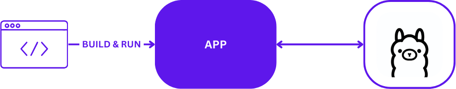
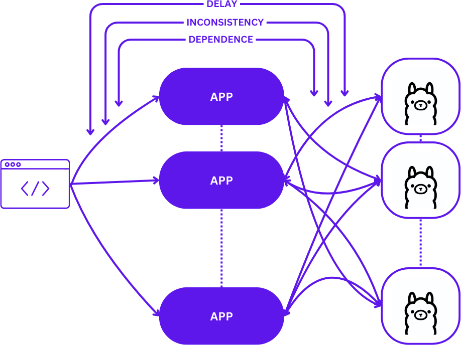
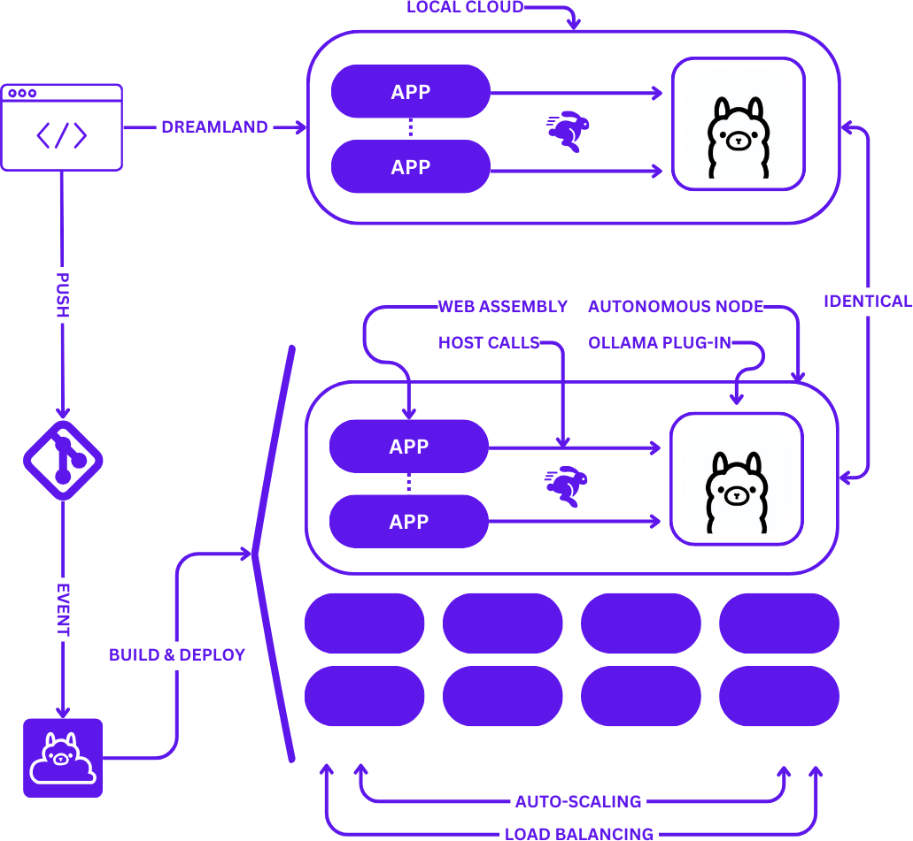

<h1 align="center">
  <a href="https://github.com/ollama-cloud" target="_blank" rel="noopener noreferrer">
    <picture>
      <source media="(prefers-color-scheme: dark)" srcset="images/logo-cube.svg">
      
    </picture>
  </a>
  <br />
  Ollama Cloud

</h1>

**Ollama Cloud** is a Highly Scalable Cloud-native Stack for **Ollama**. Help us shine by turning a ★ into a ⭐!

<br />

<div align="center">

https://github.com/ollama-cloud/get-started/assets/76626119/f9bd279f-5159-4b89-9e61-0f18b142243d

</div>

Development usually kicks off on your local machine, comfy and controlled.
<div align="center">
<picture>
      <source media="(prefers-color-scheme: dark)" srcset="images/typical-local-dev.png">
      
</picture>
</div>

But moving to production? That’s a huge leap — hello, delay, inconsistency, and dependence.
<div align="center">
<picture>
      <source media="(prefers-color-scheme: dark)" srcset="images/typical-deployment.png">
      
</picture>
</div>


**Ollama Cloud** steps in with some solid perks:
- **Consistency**: If it works locally, it'll work at scale with no change to your code.
- **Simplicity**: Can be deployed at scale with no DevOps or SRE skills.
- **A Cloud Platform**: Empowers developers with self-service capabilities.

What you see locally is what you get in production. Basically, "Local Is Production". Maybe we should call it LIP 🫦, lol.
<div align="center">
<picture>
      <source media="(prefers-color-scheme: dark)" srcset="images/with-ollama-cloud.png">
      
</picture>
</div>

> Notice the use of host calls over REST APIs, which significantly speeds up communication, enhances reliability, and ensures privacy.

Now you can focus on building amazing AI applications without worrying about the usual steps involved in taking them to production, such as DevOps or service dependencies. You can relax, as now it's a mere git push away!

**Ollama Cloud** is based on the following components:

- [tau](https://github.com/taubyte/tau): The implementation of [taubyte](https://github.com/taubyte), a solution to build autonomous cloud computing platforms.
- [ollama plugin](https://github.com/samyfodil/ollama): A plugin that allows calling [ollama](https://github.com/ollama/ollama) from WebAssembly.
- [dreamland](https://github.com/taubyte/dreamland): A tool that allows running a taubyte based cloud on your computer for local development and E2E automated testing.


## Set Up Your Local Environment

First, prepare your local environment with `dreamland`, `tau-cli`, `docker`, and the necessary tools to build the ollama plugin.

### Dreamland & Tau-CLI
If you have Node.js, just run:
```bash
npm i @taubyte/dream @taubyte/cli
```

If not, check [dreamland](https://github.com/taubyte/dreamland) and [tau-cli](https://github.com/taubyte/tau-cli) for other installation methods.

### Docker
To install Docker simply use:
```bash
curl -fsSL https://get.docker.com | sh
```

### Build Tools
Building the plugin requires `go`, but ollama itself needs:
- cmake version 3.24 or higher
- go version 1.22 or higher
- gcc version 11.4.0 or higher

**On Ubuntu Linux**, install gcc & cmake with:
```bash
sudo apt install build-essential
``` 
For Go, follow the steps at [Go's official installation guide](https://go.dev/doc/install).

**On macOS**, you can install these using:
```bash
brew install go cmake gcc
```

### Hardware Acceleration
If you're unsure whether you have the necessary development libraries for your acceleration hardware, please refer to [https://github.com/ollama/ollama/blob/main/docs/development.md](https://github.com/ollama/ollama/blob/main/docs/development.md).


## Build the Plugin
To build the plugin, first clone the repository:
```bash
git clone https://github.com/samyfodil/ollama.git
```

Then, compile the C++ backend:
```bash
cd ollama
go generate ./...
```

Finally, build the plugin itself:
```bash
cd tau
go build . -o plugin
```

That's it! You should now have a `plugin` executable.

## Start a Local Cloud
With the plugin built, it's time to start a local cloud. Run:
```bash
dream new multiverse
```

Wait until it indicates that the universe is ready.

## Attach Plugin
The Cloud you've just started lacks LLM capabilities. To add these, load the plugin by running:
```bash
dream inject attach-plugin -p /path/to/plugin
```

If you haven't changed directories, it should be:
```bash
dream inject attach-plugin -p $(pwd)/plugin
```

Now, you're all set to kick ass!

## What's next
 - [Create your first application](docs/tutorials/create-first-app.md)

## Acknowledgement
This project stands on the shoulders of the projects mentioned in the introduction, as well as ollama itself. Please show your support by leaving a ⭐ if you find them useful.
